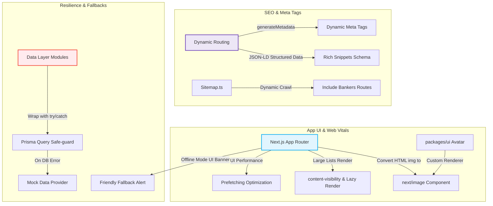

# KẾ HOẠCH TỐI ƯU HÓA TOÀN DIỆN HỆ THỐNG BANKNG (2026)

Tài liệu này phác thảo kế hoạch tối ưu hóa chi tiết và toàn diện cho dự án **bankng** (Next.js 15 Monorepo). Kế hoạch tập trung cải thiện 3 khía cạnh cốt lõi: **SEO Nâng cao (Search Engine Optimization)**, **Hiệu năng & Trải nghiệm Web Vitals**, và **Khả năng chịu lỗi hệ thống (Resilience & Database Fallbacks)**.

Kế hoạch này được thiết kế theo cấu trúc mô-đun hóa, chia làm các task độc lập, rõ ràng để bàn giao trực tiếp cho các subagents lập trình triển khai một cách hiệu quả và an toàn.

---

## 📌 BẢN ĐỒ TỐI ƯU HÓA (ARCHITECTURAL OVERVIEW)



---

## PART 1: TỐI ƯU HÓA SEO & META TAGS CHUYÊN SÂU (ADVANCED SEO & STRUCTURED DATA)
**Mục tiêu**: Giúp các trang động (Dynamic Routes) có đầy đủ Meta Tags, OpenGraph chuẩn SEO và Schema Markup (JSON-LD) để hiển thị các Rich Snippets hấp dẫn trên Google Search (giúp tăng Click-Through Rate - CTR).

### 📋 Danh sách Tasks thực thi

#### 🎯 Task 1.1: Tối ưu SEO & JSON-LD Schema cho Trang Chi tiết Banker
*   **Vị trí file**: [banker/[slug]/page.tsx](file:///Users/gray/Documents/bankng/apps/web/src/app/banker/%5Bslug%5D/page.tsx)
*   **Mô tả công việc**:
    1.  Bổ dung hàm `generateMetadata` lấy dữ liệu từ `getBanker(slug)`. Nếu banker không tồn tại, trả về metadata mặc định (ví dụ: *"Thông tin nhân viên ngân hàng không tồn tại"*). Nếu có, sinh ra:
        *   `title`: `[Tên Banker] - Nhân viên xuất sắc tại [Tên Ngân hàng] | Bankng`
        *   `description`: `Liên hệ trực tiếp với banker [Tên Banker] hỗ trợ tại [Tỉnh/Thành] để được tư vấn miễn phí các sản phẩm [Sản phẩm thế mạnh]. Cập nhật hồ sơ xác thực và đánh giá của khách hàng.`
        *   `openGraph` và `twitter` tags hoàn chỉnh với avatar làm ảnh đại diện.
    2.  Nhúng cấu trúc **JSON-LD Schema** cho Banker:
        *   `Person` schema: tên, email, chức vụ, ảnh đại diện (`image`), cơ quan làm việc (`worksFor` -> Ngân hàng).
        *   `ProfessionalService` schema: cung cấp dịch vụ tài chính tại khu vực tỉnh thành cụ thể, có thông tin rating (`aggregateRating` dựa trên `rating` và `reviewCount`).
*   **Tiêu chuẩn kiểm duyệt (UAT)**: Hàm `generateMetadata` chạy trơn tru, không crash khi thiếu dữ liệu, thẻ script JSON-LD hợp lệ theo Google Rich Results Test.

#### 🎯 Task 1.2: Tối ưu SEO & JSON-LD Schema cho Trang Chi tiết Sản phẩm
*   **Vị trí file**: [product/[slug]/page.tsx](file:///Users/gray/Documents/bankng/apps/web/src/app/product/%5Bslug%5D/page.tsx)
*   **Mô tả công việc**:
    1.  Nâng cấp metadata hiện tại ở hàm `generateMetadata`: Bổ sung thông tin đầy đủ về mức lãi suất tốt nhất hiện tại của sản phẩm vào description để tăng sức hấp dẫn trên Google Search.
    2.  Nhúng cấu trúc **JSON-LD Schema** cho Sản phẩm tài chính:
        *   `FinancialProduct` (hoặc `Product`) schema: tên sản phẩm, mô tả ngắn, thương hiệu (`brand` -> Ngân hàng).
        *   `Offer` hoặc `AggregateOffer` schema: thể hiện thông tin lãi suất ưu đãi (`price` là số % lãi suất, `priceCurrency` là `%`, `offers` từ các phương án/kỳ hạn vay).
*   **Tiêu chuẩn kiểm duyệt (UAT)**: Google Rich Results nhận diện đúng sản phẩm tài chính và thuộc tính lãi suất tương ứng.

#### 🎯 Task 1.3: Tối ưu SEO & JSON-LD Schema cho Trang Chi tiết Ngân hàng
*   **Vị trí file**: [bank/[slug]/page.tsx](file:///Users/gray/Documents/bankng/apps/web/src/app/bank/%5Bslug%5D/page.tsx)
*   **Mô tả công việc**:
    1.  Nâng cấp metadata hiện tại ở hàm `generateMetadata` của trang ngân hàng.
    2.  Nhúng cấu trúc **JSON-LD Schema**:
        *   `BankOrCreditUnion` schema: tên ngân hàng, logo, địa chỉ website chính thức.
        *   `LocalBusiness` / `FinancialService` schema cho danh sách chi nhánh phòng giao dịch kèm theo địa chỉ (`address`) và tỉnh thành.
*   **Tiêu chuẩn kiểm duyệt (UAT)**: Schema hợp lệ, nhận diện đúng thực thể ngân hàng và mạng lưới chi nhánh.

#### 🎯 Task 1.4: Tối ưu SEO & JSON-LD Schema cho Trang Chi tiết Tin tức
*   **Vị trí file**: [tin-tuc/[slug]/page.tsx](file:///Users/gray/Documents/bankng/apps/web/src/app/tin-tuc/%5Bslug%5D/page.tsx)
*   **Mô tả công việc**:
    1.  Nâng cấp metadata hiện tại ở hàm `generateMetadata` của bài viết tin tức.
    2.  Nhúng cấu trúc **JSON-LD Schema**:
        *   `NewsArticle` hoặc `BlogPosting` schema: tiêu đề bài viết (`headline`), ảnh cover (`image`), ngày xuất bản (`datePublished`), ngày cập nhật (`dateModified`), tác giả (`author` -> `Person`), đơn vị xuất bản (`publisher` -> `Organization` Bankng).
*   **Tiêu chuẩn kiểm duyệt (UAT)**: Google Search Console ghi nhận dữ liệu có cấu trúc bài viết (Article) hợp lệ.

#### 🎯 Task 1.5: Cập nhật Sitemap động cho Bankers
*   **Vị trí file**: [sitemap.ts](file:///Users/gray/Documents/bankng/apps/web/src/app/sitemap.ts)
*   **Mô tả công việc**:
    1.  Cập nhật hàm `sitemap` để truy vấn danh sách tất cả Banker đang hoạt động (`isActive: true`) từ database:
        ```typescript
        const bankers = await prisma.banker.findMany({
          where: { isActive: true },
          select: { slug: true, updatedAt: true }
        });
        ```
    2.  Bổ sung các đường dẫn `/banker/${b.slug}` vào sitemap trả về.
    3.  Đảm bảo khối `try-catch` hiện tại bảo vệ sitemap hoạt động bình thường kể cả khi Prisma offline bằng cách trả về static routes.
*   **Tiêu chuẩn kiểm duyệt (UAT)**: Truy cập `/sitemap.xml` hiển thị đầy đủ link của các bankers cùng với banks, products và articles.

---

## PART 2: TỐI ƯU HÓA HIỆU NĂNG & TRẢI NGHIỆM WEB VITALS (PERFORMANCE & WEB VITALS)
**Mục tiêu**: Giảm thiểu CLS (Cumulative Layout Shift), LCP (Largest Contentful Paint), và tối ưu hóa tải trang bằng cách áp dụng Next.js Image, CSS-render optimization, và Prefetch tuning.

### 📋 Danh sách Tasks thực thi

#### 🎯 Task 2.1: Chuyển đổi các thẻ `` HTML sang component `next/image`
*   **Vị trí các file**:
    *   `apps/web/src/app/lai-suat/[tinh-thanh]/page.tsx`
    *   `apps/web/src/app/lai-suat/page.tsx`
    *   `apps/web/src/app/san-pham-cong-dong/page.tsx`
    *   `apps/web/src/app/tin-tuc/[slug]/page.tsx` (ảnh cover bài viết, cần tối ưu LCP bằng thuộc tính `priority`)
    *   `apps/web/src/components/bank-ticker.tsx`
    *   `apps/web/src/components/dynamic-compare-matrix.tsx`
    *   `apps/web/src/components/homepage-rates-tabs.tsx`
    *   `apps/web/src/modules/public/components/article-card.tsx`
    *   `apps/web/src/modules/public/components/banker-card.tsx` (logo ngân hàng)
    *   `apps/web/src/modules/public/components/rate-table.tsx`
*   **Mô tả công việc**:
    1.  Thay thế tất cả thẻ HTML `` bằng component `<Image />` từ `"next/image"`.
    2.  Thiết lập thuộc tính `width` và `height` rõ ràng hoặc sử dụng `fill` cùng `sizes` hợp lý để chống giật trang (CLS).
    3.  Đối với ảnh thuộc màn hình đầu tiên (LCP) như ảnh cover trong `tin-tuc/[slug]/page.tsx` hoặc logo ngân hàng chính trên trang chủ, thiết lập thuộc tính `priority={true}` và `fetchpriority="high"`.
    4.  Cấu hình domains/patterns tải ảnh ngoại miền (như `cdn.vietqr.io`) trong `next.config.js` / `next.config.mjs` nếu cần thiết để Next.js tối ưu hóa ảnh.
*   **Tiêu chuẩn kiểm duyệt (UAT)**: Điểm số Performance trên Lighthouse cải thiện rõ rệt, không còn cảnh báo "Image elements do not have explicit width and height".

#### 🎯 Task 2.2: Tối ưu hóa component Avatar trong `@bankng/ui`
*   **Vị trí file**: [avatar.tsx](file:///Users/gray/Documents/bankng/packages/ui/src/components/avatar.tsx)
*   **Mô tả công việc**:
    *   Vì `@bankng/ui` là một package chia sẻ trong monorepo, việc import trực tiếp `next/image` có thể làm mất đi tính linh hoạt của thư viện UI này nếu mở rộng sang các dự án React khác không dùng Next.js.
    *   **Giải pháp kiến trúc**: Nâng cấp component `AvatarProps` để hỗ trợ một prop custom renderer:
        ```typescript
        type AvatarProps = {
          src?: string | null;
          alt?: string;
          size?: "sm" | "md" | "lg";
          className?: string;
          renderImage?: (props: { src: string; alt: string; className: string }) => React.ReactNode;
        };
        ```
    *   Tại `Avatar` component, nếu có `renderImage` thì gọi nó thay vì thẻ `` mặc định.
    *   Tại các nơi sử dụng `Avatar` trong `apps/web` (như `banker/[slug]/page.tsx`, `banker-card.tsx`), import component `<Image>` của Next.js và truyền vào qua `renderImage`:
        ```tsx
        <Avatar
          src={banker.avatarUrl}
          alt={banker.userName}
          renderImage={(props) => (
            <Image
              src={props.src}
              alt={props.alt}
              className={props.className}
              width={150}
              height={150}
              priority
            />
          )}
        />
        ```
*   **Tiêu chuẩn kiểm duyệt (UAT)**: Project build thành công, UI avatar hiển thị bình thường và ảnh avatar được tối ưu bằng Next.js Image Optimization.

#### 🎯 Task 2.3: Áp dụng `content-visibility: auto` cho danh sách lớn
*   **Vị trí file**: [banker-directory-client.tsx](file:///Users/gray/Documents/bankng/apps/web/src/app/danh-sach-bankers/banker-directory-client.tsx) và [banker-card.tsx](file:///Users/gray/Documents/bankng/apps/web/src/modules/public/components/banker-card.tsx)
*   **Mô tả công việc**:
    1.  Tại danh sách hiển thị lớn (như grid chứa hàng trăm `BankerCard`), áp dụng CSS rule `content-visibility: auto` và `contain-intrinsic-size` (ví dụ `contain-intrinsic-size: 0 180px`) cho mỗi item card nằm ngoài màn hình (viewport).
    2.  Điều này giúp trình duyệt bỏ qua công đoạn render layout của các thẻ card chưa xuất hiện, làm giảm đáng kể CPU & RAM tải trang, tối ưu điểm tương tác INP.
*   **Tiêu chuẩn kiểm duyệt (UAT)**: Danh sách cuộn mượt mà hơn trên các thiết bị cấu hình yếu, cây DOM không bị quá tải.

#### 🎯 Task 2.4: Tinh chỉnh Prefetching cho các liên kết Next.js
*   **Vị trí các file**: Tất cả các file có sử dụng Next.js `<Link>` dẫn đến các trang nặng (ví dụ: so sánh chi tiết, danh sách bankers, v.v.).
*   **Mô tả công việc**:
    1.  Rà soát các component liên kết. Thiết lập thuộc tính `prefetch={false}` cho các `<Link>` không thiết yếu nằm ở Footer hoặc các menu phụ chưa cần tải trước tài nguyên.
    2.  Chỉ giữ prefetch mặc định (`true`) cho các link điều hướng chính trên thanh Navbar hoặc Hero CTA nhằm giảm lưu lượng tải ảo từ phía client.
*   **Tiêu chuẩn kiểm duyệt (UAT)**: Số lượng request mạng được giảm thiểu đáng kể khi người dùng cuộn trang.

---

## PART 3: TĂNG CƯỜNG KHẢ NĂNG CHỊU LỖI & RESILIENCE (DATABASE RESILIENCE)
**Mục tiêu**: Đảm bảo toàn bộ ứng dụng vẫn hoạt động bình thường bằng cách cung cấp dữ liệu Mock/Fallback và hiển thị giao diện phù hợp khi Prisma/Database gặp sự cố (offline) thay vì trả về trang lỗi 500 trắng xóa.

### 📋 Danh sách Tasks thực thi

#### 🎯 Task 3.1: Bổ sung Mock Bankers Data hoàn chỉnh
*   **Vị trí file**: [mock-data.ts](file:///Users/gray/Documents/bankng/apps/web/src/modules/public/mock-data.ts)
*   **Mô tả công việc**:
    1.  Định nghĩa và export danh sách `MOCK_BANKERS` (tối thiểu 6-8 bankers) chứa đầy đủ các thuộc tính của `BankerProfile` như: `id`, `slug`, `title`, `bio`, `rating`, `reviewCount`, `isVerified`, `bankName`, `bankSlug`, `bankLogoUrl`, `userName`, `userEmail`, `avatarUrl`, `createdAt`.
    2.  Đảm bảo dữ liệu mock phong phú, khớp với các tỉnh thành và ngân hàng giả lập hiện có.
*   **Tiêu chuẩn kiểm duyệt (UAT)**: Xuất dữ liệu `MOCK_BANKERS` thành công, không gặp lỗi kiểu dữ liệu.

#### 🎯 Task 3.2: Nâng cấp chịu lỗi cho Mô-đun Bankers
*   **Vị trí file**: [data-bankers.ts](file:///Users/gray/Documents/bankng/apps/web/src/modules/public/data-bankers.ts)
*   **Mô tả công việc**:
    1.  Bao bọc toàn bộ mã nguồn của các hàm: `getBankers`, `getBanker`, và `getBankerStats` bằng khối `try/catch`.
    2.  Khi phát hiện lỗi kết nối database (ngoại lệ Prisma), thực hiện:
        *   Log cảnh báo chi tiết qua `console.warn`.
        *   Trong `getBankers`: lọc danh sách từ `MOCK_BANKERS` dựa trên bộ lọc đầu vào (`opts`) và trả về kết quả giả lập.
        *   Trong `getBanker`: tìm kiếm và trả về banker khớp với `slug` trong `MOCK_BANKERS`.
        *   Trong `getBankerStats`: tính toán thống kê động từ danh sách `MOCK_BANKERS`.
*   **Tiêu chuẩn kiểm duyệt (UAT)**: Khi ngắt kết nối database tạm thời, trang `/danh-sach-bankers` và `/banker/[slug]` vẫn mở được bình thường và hiển thị dữ liệu giả lập.

#### 🎯 Task 3.3: Nâng cấp chịu lỗi cho Mô-đun Sản phẩm, Ngân hàng & Tin tức
*   **Vị trí file**: [data.ts](file:///Users/gray/Documents/bankng/apps/web/src/modules/public/data.ts) và [data-articles.ts](file:///Users/gray/Documents/bankng/apps/web/src/modules/public/data-articles.ts)
*   **Mô tả công việc**:
    1.  Bao bọc toàn bộ các hàm truy vấn còn lại bằng khối `try/catch`:
        *   Trong `data.ts`: `getPublicBankSlugs`, `getPublicProductSlugs`, `getPublicHomeData`, `getPublicProduct`, `getPublicBank`.
        *   Trong `data-articles.ts`: `getArticles`, `getArticle`, `getArticleSlugs`.
    2.  Đảm bảo mỗi hàm trả về dữ liệu mock tương ứng (ví dụ: `MOCK_LOAN_PRODUCTS`, `MOCK_BANKS`, `MOCK_ARTICLES`) khi database sập.
*   **Tiêu chuẩn kiểm duyệt (UAT)**: Trang chi tiết ngân hàng `/bank/[slug]`, chi tiết sản phẩm `/product/[slug]`, tin tức `/tin-tuc/[slug]` không bị lỗi 500 khi database offline.

#### 🎯 Task 3.4: Xây dựng UI Alert "Chế độ Offline/Demo" thân thiện
*   **Vị trí các file**:
    *   Trang chủ: `apps/web/src/app/page.tsx`
    *   Danh sách Bankers: `apps/web/src/app/danh-sach-bankers/page.tsx`
    *   Và các layout chung/layout con nếu cần.
*   **Mô tả công việc**:
    1.  Xây dựng một cơ chế phát hiện hệ thống đang chạy ở chế độ offline (DB sập). Chúng ta có thể bổ sung một cờ boolean `isOffline` trả về từ các module fetch data (hoặc thiết lập biến môi trường/check kết nối).
    2.  Khi phát hiện `isOffline === true`, hiển thị một banner thông báo nhỏ (Alert banner) màu vàng hổ phách rất tinh tế ở đầu trang:
        > ⚠️ **Thông báo hệ thống:** Máy chủ dữ liệu hiện đang bảo trì. Bạn đang trải nghiệm hệ thống ở **chế độ Offline/Demo** với dữ liệu mô phỏng. Các tính năng đăng ký, tư vấn có thể tạm thời bị gián đoạn.
    3.  Banner này cần có nút đóng và thiết kế glassmorphism sang trọng để không làm xấu trải nghiệm UI hiện tại.
*   **Tiêu chuẩn kiểm duyệt (UAT)**: Hiển thị banner chính xác chỉ khi database không hoạt động, có thể đóng được và giao diện hiển thị chuyên nghiệp.

---

## 📅 LỘ TRÌNH TRIỂN KHAI (MILESTONES & IMPLEMENTATION ROADMAP)

Để đảm bảo an toàn tối đa cho hệ thống, lộ trình triển khai nên được chia làm 3 đợt (waves):

### Wave 1: Xây dựng Khả năng Chịu lỗi & Resilience (Part 3)
*   **Mục tiêu**: Đóng băng các lỗi crash 500 trước khi thực hiện tối ưu hóa khác.
*   **Thời gian ước tính**: 1 ngày

### Wave 2: Tối ưu hóa Web Vitals & Hiệu năng (Part 2)
*   **Mục tiêu**: Nâng cấp toàn bộ hình ảnh và render để đạt điểm số Lighthouse tối ưu.
*   **Thời gian ước tính**: 1.5 ngày

### Wave 3: Tối ưu hóa SEO & Schema Markup (Part 1)
*   **Mục tiêu**: Bổ sung sitemap động, meta tags và cấu trúc JSON-LD hoàn chỉnh cho toàn bộ hệ thống.
*   **Thời gian ước tính**: 1 ngày

---

## 🛠️ CAM KẾT CHẤT LƯỢNG & VERIFICATION PROTOCOL

1.  **Chạy lint & typecheck sau mỗi thay đổi**: Subagents bắt buộc phải chạy `pnpm lint` và `pnpm tsc` trên toàn bộ monorepo sau khi chỉnh sửa code để tránh lỗi compile.
2.  **Chống regression**: Lock toàn bộ logic nghiệp vụ cũ, chỉ thay đổi luồng xử lý lỗi và phần hiển thị/SEO, không sửa đổi cấu trúc schema của database hay nghiệp vụ so sánh cốt lõi.
3.  **Lore Commit Protocol**: Mọi commit từ subagents phải tuân thủ Lore protocol, mô tả rõ ràng lý do thay đổi và kiểm thử.
